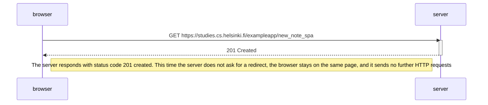

```mermaid

sequenceDiagram
    participant browser
    participant server

    browser->>server: GET https://studies.cs.helsinki.fi/exampleapp/new_note_spa
    activate server
    server-->>browser: 201 Created 
    deactivate server

    Note right of browser: The server responds with status code 201 created. This time the server does not ask for a redirect, the browser stays on the same page, and it sends no further HTTP requests

    

```